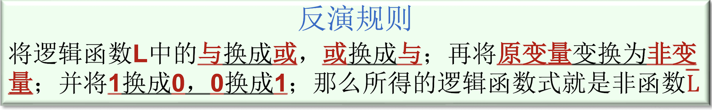
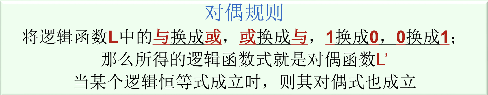

**更多的是练习加经验,以下是一些可能需要记住的内容**

==**善用插1法:$A+\bar{A}=1$**==

==分配律==:$A+BC=(A+B)(A+C),$$A(B+C)=AB+AC$  

==吸收律==:$A+AB=A$(特殊情况的分配律)  
$\text{}A(A+B)=A(=A+AB)$  
$A+\bar{A}B=A+B(=A+B(A+\bar{A})$)

常用恒等式:$AB+\bar{A}C+BC=AB+\bar{A}C$

**==德摩根律==:打散,取反,变号**

*有时可以用对偶式来证明原式*

正逻辑(高电平为1,低电平为0)vs负逻辑(高电平为0,低电平为1)

